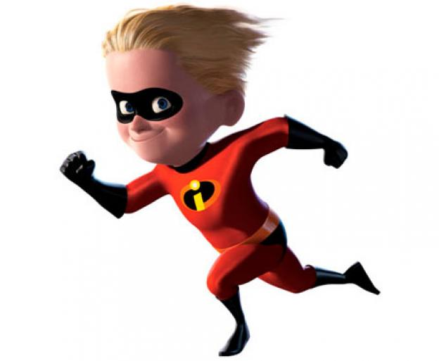
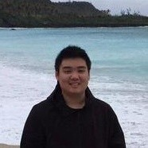
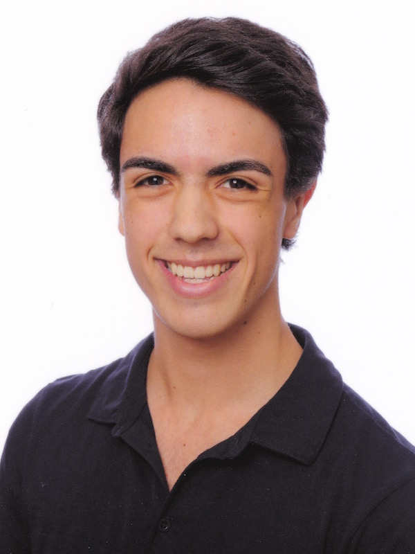
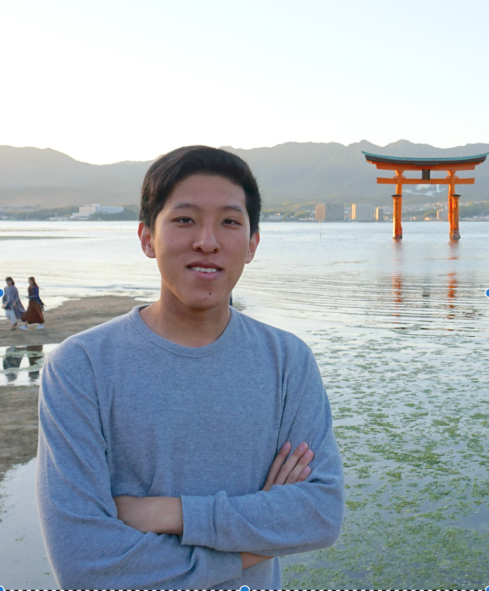

# DASH.ai

## Project Synopsis
TBD

## Team Members
| Member             | Photo                                                                 |
| ------------------ | --------------------------------------------------------------------- |
| Joseph Chang       |           |
| Aleksander Dash    |           |
| Nolan Handali      |        |
| Jeffrey Zhang      |   |

## Team Skills
| Member          | Skills                        | Personal Traits  | Desired Growth | Weaknesses |
| --------------- | ----------------------------- | ---------------- | -------------- | ---------- |
| Joseph Chang    | Machine Learning, Algorithms, Systems  | Collaborative, Loves bouncing ideas off each other   | Teamwork and Good Code Quality  |  Time management     |
| Aleksander Dash |                               |                  |                |            |
| Nolan Handali   |  AI/ML, Algorithms, backend   |  Collaborative, hard working, open minded                | Teamwork, prototyping              | Front end, UI/UX         |
| Jeffrey Zhang   |                               |                  |                |            |

## Team Communication
* Internal communication via Facebook Messenger
* Stanford Email: {chang100, adash, nolanh, jz5003}@stanford.edu
